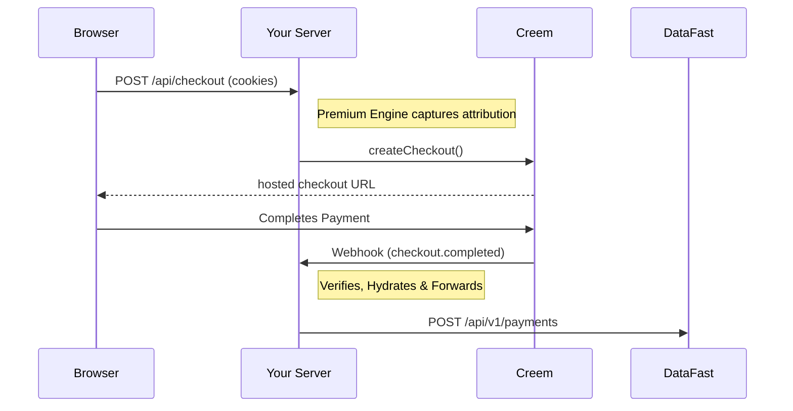

# creem-datafast-integration

Connect [CREEM](https://creem.io) payments to [DataFast](https://datafa.st) analytics without writing any glue code. The **Premium Engine** handles checkout attribution, webhook forwarding, and transaction hydration with zero configuration.

[](https://github.com/samolubukun/creem-datafast-integration/actions/workflows/ci.yml)
[](https://www.npmjs.com/package/creem-datafast-integration)
[](https://opensource.org/licenses/MIT)

## 💎 The Premium Difference

- **Premium Engine Architecture** — A domain-driven structure (Foundation, Engine, Gateways) designed for maximum maintainability and scale.
- **Zero-Config Tracking** — One-liner browser script automatically finds and attributes all checkout links on your page.
- **Transaction Hydration** — Automatically fetches missing transaction details from Creem to ensure 100% data accuracy in DataFast, including taxes and discounts.
- **Framework Native** — First-class support for Next.js App Router and Express with drop-in adapters.
- **Production Idempotency** — Atomic deduplication with built-in Memory and Upstash Redis adapters to prevent duplicate revenue reporting.
- **Edge-Ready** — Uses Web Crypto API (`SubtleCrypto`); fully compatible with Cloudflare Workers, Vercel Edge, Bun, and Deno.

---

## 🏗️ Project Structure

The package follows an enterprise-grade domain-driven architecture:

```text
src/
├── foundation/     # Base types, custom errors, and Zod schemas
├── infrastructure/ # Low-level utilities (HTTP, Finance, Context)
├── services/       # External Proxy clients (Creem SDK, DataFast API)
├── engine/         # Core business logic (Checkout flow, Webhook pipe)
├── gateways/       # Official framework adapters (Next.js, Express)
├── storage/        # Persistence layers (In-memory, Upstash Redis)
└── browser/        # Client-side auto-initialization scripts
```

---

## 🚀 How It Works



---

## 📦 Installation

```bash
npm install creem-datafast-integration
```

---

## 🏁 Quickstart

### 1. Initialize the Client

```ts
import { createCreemDataFast } from 'creem-datafast-integration';

export const creemDataFast = createCreemDataFast({
  creemApiKey: process.env.CREEM_API_KEY!,
  creemWebhookSecret: process.env.CREEM_WEBHOOK_SECRET!,
  datafastApiKey: process.env.DATAFAST_API_KEY!,
  testMode: process.env.NODE_ENV !== 'production'
});
```

### 2. Next.js Integration

```ts
// app/api/checkout/route.ts
import { creemDataFast } from '@/lib/creem';

export async function POST(request: Request) {
  const { checkoutUrl } = await creemDataFast.createCheckout(
    { productId: 'prod_123', successUrl: '/success' },
    { request }
  );
  return Response.redirect(checkoutUrl, 303);
}

// app/api/webhooks/creem/route.ts
import { createNextWebhookHandler } from 'creem-datafast-integration/next';
import { creemDataFast } from '@/lib/creem';

export const POST = createNextWebhookHandler(creemDataFast);
```

### 3. Express Integration

```ts
import express from 'express';
import { createExpressWebhookHandler } from 'creem-datafast-integration/express';

const app = express();

app.post('/api/checkout', async (req, res) => {
  const { checkoutUrl } = await creemDataFast.createCheckout(
    { productId: 'prod_123', successUrl: '/success' },
    { request: { headers: req.headers, url: req.url } }
  );
  res.redirect(303, checkoutUrl);
});

app.post(
  '/webhooks/creem',
  express.raw({ type: 'application/json' }),
  createExpressWebhookHandler(creemDataFast)
);
```

---

## ⚙️ Configuration

| Option | Type | Default | Description |
|---|---|---|---|
| `creemApiKey` | `string` | **Required** | Your Creem Secret API Key |
| `creemWebhookSecret` | `string` | **Required** | Your Creem Webhook Secret (for sig verification) |
| `datafastApiKey` | `string` | **Required** | Your DataFast API Key |
| `testMode` | `boolean` | `false` | Enable test mode for transactions |
| `idempotencyStore`| `Store` | `MemoryStore` | Custom storage for deduplication |
| `logger` | `Logger` | `Console` | Custom logger implementation |

---

## 🚨 Error Handling

The package provides custom error classes for granular control:

```ts
import { 
  InvalidCreemSignatureError, 
  MissingTrackingError,
  CreemDataFastError 
} from 'creem-datafast-integration';

try {
  await creemDataFast.handleWebhook(payload, signature);
} catch (err) {
  if (err instanceof InvalidCreemSignatureError) {
    // Handle unauthorized webhook attempts
  }
}
```

---

## 🌐 Zero-Config Browser Script

Automatically attributes all Creem links to DataFast without manual implementation.

```html
<script 
  async 
  defer 
  src="https://cdn.jsdelivr.net/npm/creem-datafast-integration/dist/client.js" 
  data-auto-init="true">
</script>
```

---

## 📜 Supported Events

| Event | Action | Result in DataFast |
|---|---|---|
| `checkout.completed` | Simple Attribution | One-time Payment |
| `subscription.paid`  | **Auto-Hydration** | Monthly/Annual Revenue |
| `refund.created`     | Revenue Reversal | Negative Balance Adjustment |

---

## ⚖️ License

Distributed under the [MIT](LICENSE) License. See `LICENSE` for more information.
`refund.created` | Negative Revenue Adjustment |

## ⚖️ License

[MIT](LICENSE)
